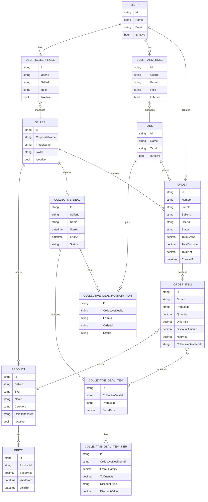

```mermaid
erDiagram
    USER {
      string Id
      string Name
      string Email
      bool   IsActive
    }

    SELLER {
      string Id
      string CorporateName
      string TradeName
      string TaxId
      bool   IsActive
    }

    FARM {
      string Id
      string Name
      string TaxId
      bool   IsActive
    }

    USER_SELLER_ROLE {
      string Id
      string UserId
      string SellerId
      string Role
      bool   IsActive
    }

    USER_FARM_ROLE {
      string Id
      string UserId
      string FarmId
      string Role
      bool   IsActive
    }

    PRODUCT {
      string Id
      string SellerId
      string Sku
      string Name
      string Category
      string UnitOfMeasure
      bool   IsActive
    }

    PRICE {
      string Id
      string ProductId
      decimal BasePrice
      datetime ValidFrom
      datetime ValidTo
    }

    COLLECTIVE_DEAL {
      string Id
      string SellerId
      string Name
      datetime StartAt
      datetime EndAt
      string Status
    }

    COLLECTIVE_DEAL_ITEM {
      string Id
      string CollectiveDealId
      string ProductId
      decimal BasePrice
    }

    COLLECTIVE_DEAL_ITEM_TIER {
      string Id
      string CollectiveDealItemId
      decimal FromQuantity
      decimal ToQuantity
      string DiscountType
      decimal DiscountValue
    }

    COLLECTIVE_DEAL_PARTICIPATION {
      string Id
      string CollectiveDealId
      string FarmId
      string OrderId
      string Status
    }

    ORDER {
      string Id
      string Number
      string FarmId
      string SellerId
      string UserId
      string Status
      decimal TotalGross
      decimal TotalDiscount
      decimal TotalNet
      datetime CreatedAt
    }

    ORDER_ITEM {
      string Id
      string OrderId
      string ProductId
      decimal Quantity
      decimal UnitPrice
      decimal DiscountAmount
      decimal NetPrice
      string CollectiveDealItemId
    }

    %% Identidade e acesso
    USER ||--o{ USER_SELLER_ROLE : has
    USER ||--o{ USER_FARM_ROLE : has
    USER_SELLER_ROLE }o--|| SELLER : manages
    USER_FARM_ROLE }o--|| FARM : manages

    %% Catálogo e preços
    SELLER ||--o{ PRODUCT : offers
    PRODUCT ||--o{ PRICE : has

    %% Pool de vendas (vendas coletivas)
    SELLER ||--o{ COLLECTIVE_DEAL : creates
    COLLECTIVE_DEAL ||--o{ COLLECTIVE_DEAL_ITEM : includes
    COLLECTIVE_DEAL_ITEM ||--o{ COLLECTIVE_DEAL_ITEM_TIER : tiers
    COLLECTIVE_DEAL ||--o{ COLLECTIVE_DEAL_PARTICIPATION : has
    FARM ||--o{ COLLECTIVE_DEAL_PARTICIPATION : joins

    %% Pedidos
    FARM ||--o{ ORDER : places
    SELLER ||--o{ ORDER : receives
    USER ||--o{ ORDER : creates
    ORDER ||--o{ ORDER_ITEM : contains
    ORDER_ITEM }o--|| PRODUCT : refers
    ORDER_ITEM }o--o{ COLLECTIVE_DEAL_ITEM : optional
```