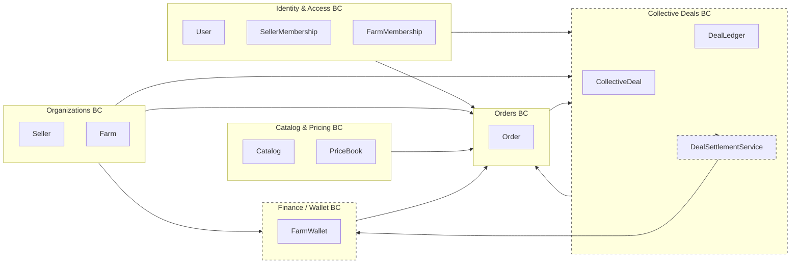

## 1. Bounded Contexts

1. **Identity & Access (I&A)**

   * Autenticação (JWT) e autorização por vínculos e papéis.
2. **Organizations**

   * Cadastro de `Seller` e `Farm`.
3. **Catalog & Pricing**

   * Catálogo de produtos do Seller e preços base.
4. **Collective Deals**

   * Pools de vendas, tiers de volume e cálculo do benefício final.
5. **Orders**

   * Pedidos, itens, totais, forma de pagamento (incluindo uso de cashback).
6. **Finance / Wallet**

   * Carteira de cashback por Farm, créditos e débitos.

---

## 2. Agregados por contexto

### 2.1. Identity & Access

**Aggregate: `User`**

* `UserId`, `Name`, `Email`, `PasswordHash`, `IsActive`.
* Regras:

  * Email único.
  * Usuário inativo não autentica.

**Aggregate: `SellerMembership`**

* `SellerMembershipId`
* `UserId`
* `SellerId`
* `Roles[]` (Owner, Manager, SalesRep, etc.)
* `Status` (Active/Inactive)

**Aggregate: `FarmMembership`**

* `FarmMembershipId`
* `UserId`
* `FarmId`
* `Roles[]` (Owner, Manager, Buyer, Viewer, etc.)
* `Status`

**Domain Service:** `AccessPolicyService`

* Centraliza checagens de permissão:
  `CanActForFarm(userId, farmId, action)`
  `CanManageSeller(userId, sellerId, action)`

---

### 2.2. Organizations

**Aggregate: `Seller`**

* `SellerId`
* `CorporateName`, `TradeName`, `TaxId`, `IsActive`.

**Aggregate: `Farm`**

* `FarmId`
* `Name`, `TaxId`, `IsActive`, `Address` (ou VO).

---

### 2.3. Catalog & Pricing

**Aggregate: `Catalog` (por Seller)**
Root: `Catalog`

* `CatalogId`
* `SellerId`
* `Products[]` (Entity `Product`)

**Entity `Product`**

* `ProductId`
* `Sku`, `Name`, `Category`, `UnitOfMeasure`, `IsActive`.

**Aggregate: `PriceBook`**

* `PriceBookId`
* `SellerId`
* `PriceEntries[]` (Entity `PriceEntry`)

**Entity `PriceEntry`**

* `ProductId`
* `CurrentPrice` (VO `Money`)
* `ValidFrom`, `ValidTo?`
* Histórico pode ser VO ou coleção.

**Domain Service:** `PricingService`

* Resolve preço base para um produto em certa data.

---

### 2.4. Collective Deals (Pool)

**Aggregate: `CollectiveDeal`**

* `CollectiveDealId`
* `SellerId`
* `Name`, `Description`
* `Period` (VO `DateRange`)
* `Status` (Draft, Open, Closed, Cancelled)
* `Items[]` (Entity `DealItem`)

**Entity: `DealItem`**

* `DealItemId`
* `ProductId`
* `BasePriceSnapshot` (VO `Money`)
* `Tiers[]` (VO `Tier`)

**VO `Tier`**

* `TierId` (ou identificável pelo índice)
* `FromQuantity`
* `ToQuantity?`
* `Discount` (VO)

**VO `Discount`**

* `Type` (Percent, FixedAmount)
* `Value`

> Observação: **nenhum desconto é aplicado diretamente ao pedido** aqui. Esse desconto é usado somente para calcular **cashback** ao fechar o Deal.

---

### 2.5. Deal Ledger / Settlement

Para saber o volume total e ratear o benefício entre Farms.

**Aggregate: `DealLedger`**

* `DealLedgerId`
* `CollectiveDealId`
* `Lines[]` (Entity `LedgerLine`)

**Entity: `LedgerLine`**

* `LedgerLineId`
* `DealItemId`
* `OrderId`
* `OrderItemId`
* `FarmId`
* `Quantity`
* `Status` (Reserved, Confirmed, Cancelled, Settled)

> Esse agregado serve para:
>
> * registrar que um pedido participou de determinado pool;
> * garantir que cada `OrderItem` só será liquidado (settled) **uma vez**.

**Domain Service: `DealDiscountCalculator`**

* `GetEffectiveTier(dealItem, totalVolume)`
* `GetEffectivePrice(dealItem, tier)`

**Domain Service: `DealSettlementService`**

* Ao receber `CollectiveDealClosed`:

  * para cada `DealItem`, calcula volume total;
  * determina `Tier` final;
  * para cada `LedgerLine` confirmada:

    * calcula diferença entre preço pago e preço efetivo com tier;
    * gera valor de cashback para a `Farm`.

---

### 2.6. Orders

**Aggregate: `Order`**

* `OrderId`
* `Number`
* `SellerId`
* `FarmId`
* `CreatedByUserId`
* `Status` (Draft, Placed, Confirmed, Cancelled, etc.)
* `Items[]` (Entity `OrderItem`)
* Totais:

  * `TotalGross` (sem considerar cashback)
  * `TotalNet` (após impostos/frete/etc., mas **sem** desconto de pool)
* `PaymentDetails` (VO)

**Entity: `OrderItem`**

* `OrderItemId`
* `ProductId`
* `Quantity` (VO `Quantity`)
* `UnitPrice` (Money) — preço no momento do pedido (base + promo normal)
* `NetUnitPrice` (Money) — se houver outros descontos que não sejam pool.
* `CollectiveDealParticipationRef?` (VO):

  * `CollectiveDealId`
  * `DealItemId`

> O pedido **não é reprecificado** depois do fechamento do pool.
> O benefício é calculado em separado e vira crédito na carteira.

**VO `PaymentDetails`**

* `WalletUsedAmount` (Money) — quanto foi pago com saldo de carteira.
* `OtherMethods[]` (se/ quando existirem).

---

### 2.7. Finance / Wallet (Cashback)

**Aggregate: `FarmWallet`**

* `FarmWalletId`
* `FarmId`
* `Balance` (Money)
* `Entries[]` (Entity `WalletEntry`)

**Entity: `WalletEntry`**

* `WalletEntryId`
* `Type` (`Credit`, `Debit`)
* `Amount` (Money)
* `Description`
* `Origin` (VO `WalletEntryOrigin`)
* `CreatedAt`

**VO `WalletEntryOrigin`**

* `Type` (`CollectiveDealCashback`, `OrderPayment`, etc.)
* `ReferenceId` (`CollectiveDealId`, `OrderId`, etc.)

**Domain Methods**

* `Credit(amount, origin, description)`
* `Debit(amount, origin, description)`
* `CanDebit(amount)` → garante que `Balance` não fique negativo.

**Domain Events**

* `WalletCredited(FarmId, Amount, Origin)`
* `WalletDebited(FarmId, Amount, Origin)`

---

## 3. Fluxo de domínio

### 3.1. Pedido participando de pool

1. Usuário (via I&A) é validado como `Buyer` de uma `Farm`.
2. No carrinho, escolhe produto que está em um `CollectiveDeal`.
3. Application Service de `Orders`:

   * valida `AccessPolicyService` (User ↔ Farm ↔ Seller);
   * busca preço base em `PriceBook` ou `CollectiveDeal.BasePriceSnapshot`;
   * cria `Order` e `OrderItem` com `UnitPrice` definido;
   * marca `CollectiveDealParticipationRef` no item;
   * emite evento `OrderPlaced`/`OrderConfirmed`.
4. Handler de `OrderConfirmed` no contexto de `CollectiveDeals`:

   * cria/atualiza uma `LedgerLine` em `DealLedger` com:

     * `DealItemId`, `OrderId`, `OrderItemId`, `FarmId`, `Quantity`, `Status=Confirmed`.

### 3.2. Fechamento do pool e geração de cashback

1. `CollectiveDeal` muda `Status` para `Closed` → evento `CollectiveDealClosed`.
2. `DealSettlementService` reage:

   * para cada `DealItem`:

     * lê `DealLedger` → soma `Quantity` das linhas `Confirmed`;
     * identifica `Tier` final (via `DealDiscountCalculator`);
     * calcula `PreçoEfetivoTier`.
   * para cada `LedgerLine`:

     * pega `OrderItem.UnitPrice`;
     * `diff = (UnitPrice - PreçoEfetivoTier)`;
     * se `diff > 0`: `cashback = diff * Quantity`.
     * marca linha como `Settled`.
     * emite comando/evento `CreditWallet(FarmId, cashback, origin: CollectiveDealCashback)`.
3. `FarmWallet`:

   * `Credit(cashback, origin)` → atualiza `Balance` e adiciona `WalletEntry`.

### 3.3. Uso do cashback em pedido posterior

1. Na tela de checkout, UI mostra:

   * `TotalOrder` e `FarmWallet.Balance`.
2. Usuário escolhe quanto do saldo usar (até o máximo).
3. Application Service de `Orders`:

   * consulta `FarmWallet`:

     * verifica `CanDebit(walletAmountDesired)`.
   * cria `Order` com `PaymentDetails.WalletUsedAmount`.
   * envia comando `DebitWallet(FarmId, amount, origin: OrderPayment(orderId))`.
4. `FarmWallet.Debit`:

   * garante que saldo não fique negativo.
   * emite `WalletDebited`.

---

## 4. Context Map DDD

