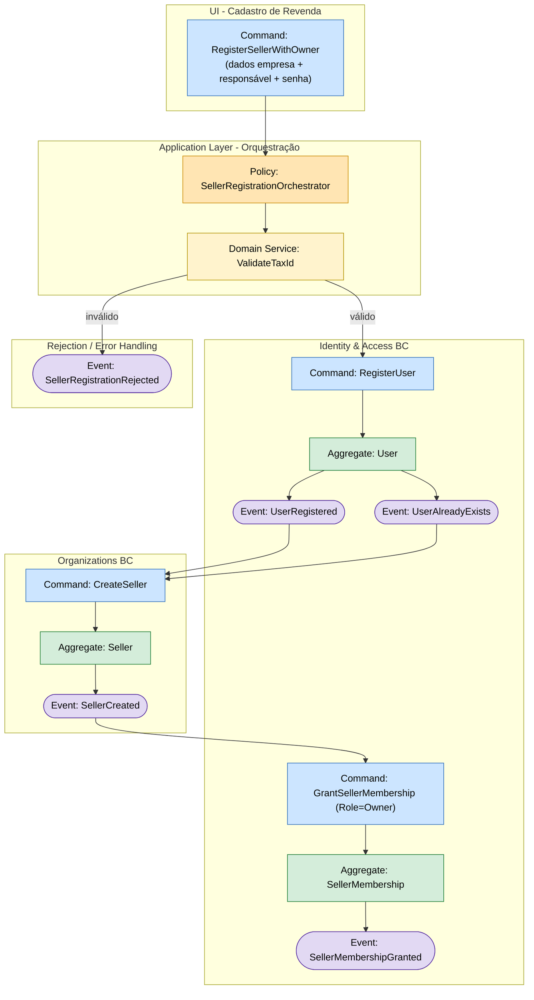

```mermaid
flowchart TD

  %% ========= UI / Entrada =========
  subgraph UI[UI - Cadastro de Revenda]
    CMD_RegisterSellerWithOwner["Command: RegisterSellerWithOwner<br/>(dados empresa + responsável + senha)"]
  end

  %% ========= Application Layer / Orquestração =========
  subgraph APP[Application Layer - Orquestração]
    POL_SellerRegistrationOrchestrator["Policy: SellerRegistrationOrchestrator"]
    SRV_ValidateTaxId["Domain Service: ValidateTaxId"]
  end

  %% ========= Identity & Access =========
  subgraph IA[Identity & Access BC]
    CMD_RegisterUser["Command: RegisterUser"]
    EVT_UserRegistered(["Event: UserRegistered"])
    EVT_UserAlreadyExists(["Event: UserAlreadyExists"])
    AGG_User["Aggregate: User"]

    CMD_GrantSellerMembership["Command: GrantSellerMembership (Role=Owner)"]
    AGG_SellerMembership["Aggregate: SellerMembership"]
    EVT_SellerMembershipGranted(["Event: SellerMembershipGranted"])
  end

  %% ========= Organizations =========
  subgraph ORG[Organizations BC]
    CMD_CreateSeller["Command: CreateSeller"]
    AGG_Seller["Aggregate: Seller"]
    EVT_SellerCreated(["Event: SellerCreated"])
  end

  %% ========= Rejected Path =========
  subgraph REJ[Rejection / Error Handling]
    EVT_SellerRegistrationRejected(["Event: SellerRegistrationRejected"])
  end

  %% ========= Fluxo principal =========
  CMD_RegisterSellerWithOwner --> POL_SellerRegistrationOrchestrator
  POL_SellerRegistrationOrchestrator --> SRV_ValidateTaxId

  %% Decisão de CNPJ
  SRV_ValidateTaxId -->|inválido| EVT_SellerRegistrationRejected
  SRV_ValidateTaxId -->|válido| CMD_RegisterUser

  %% Usuário pode ser novo ou já existir
  CMD_RegisterUser --> AGG_User
  AGG_User --> EVT_UserRegistered
  AGG_User --> EVT_UserAlreadyExists

  %% De qualquer forma, seguimos com criação do Seller (desde que policy permita)
  EVT_UserRegistered --> CMD_CreateSeller
  EVT_UserAlreadyExists --> CMD_CreateSeller

  CMD_CreateSeller --> AGG_Seller
  AGG_Seller --> EVT_SellerCreated

  %% Ao criar o Seller, conceder papel Owner ao usuário responsável
  EVT_SellerCreated --> CMD_GrantSellerMembership
  CMD_GrantSellerMembership --> AGG_SellerMembership
  AGG_SellerMembership --> EVT_SellerMembershipGranted


  %% ========= Classes visuais =========
  classDef command fill:#cce5ff,stroke:#2f6fbc,stroke-width:1px,color:#000;
  classDef policy fill:#ffe5b3,stroke:#cc8b00,stroke-width:1px,color:#000;
  classDef service fill:#fff3cd,stroke:#b69500,stroke-width:1px,color:#000;
  classDef event fill:#e2d9f3,stroke:#5a32a3,stroke-width:1px,color:#000;
  classDef aggregate fill:#d4edda,stroke:#1e7e34,stroke-width:1px,color:#000;

  class CMD_RegisterSellerWithOwner,CMD_RegisterUser,CMD_CreateSeller,CMD_GrantSellerMembership command;
  class POL_SellerRegistrationOrchestrator policy;
  class SRV_ValidateTaxId service;
  class EVT_UserRegistered,EVT_UserAlreadyExists,EVT_SellerCreated,EVT_SellerMembershipGranted,EVT_SellerRegistrationRejected event;
  class AGG_User,AGG_Seller,AGG_SellerMembership aggregate;
```